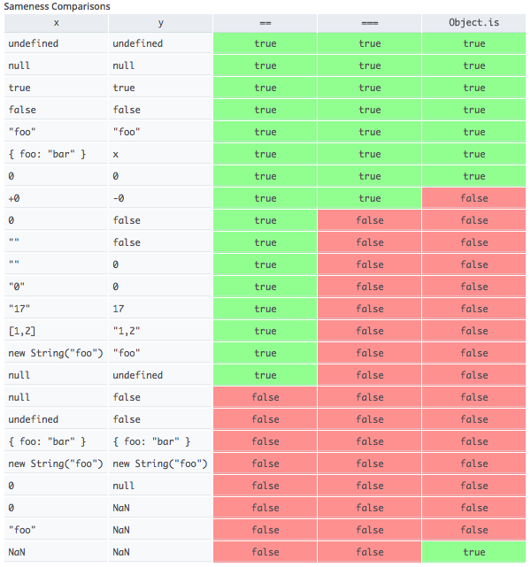

# 基本类型断言

基本类型断言匹配器有以下几个：

* [toBe](#tobe)
* [toBeEqual](#toequal)
* [toBeDefined](#tobedefined)
* [toBeTruthy](#tobetruthy)
* [toBeFalsy](#tobefalsy)
* [toBeNaN](#tobenan)
* [toBeNull](#tobenull)
* [toBeCloseTo](#tobecloseto)
* [toBeUndefined](#tobeundefined)

## toBe

*toBe*匹配器在`Jest`中的主要作用是用于断言基本类型的。其使用`Object.is`来判断断言结果，而不是使用的全等运算符(===)。

使用*toBe*
判断对象是否相等的时候，其判断是的两个对象是不是使用的同一个引用，而不是比较其字面值是否相等，如果要比较再个对象的字面量是否相等，请使用[toEqual](#toequal)。

请不要使用*toBe*来比较两个浮点数是否相等，因为实现的原因，在`JavaScript`和其它大多数的语言中，*0.1+0.2*并不完全等于*0.3*。(
因为精度丢失)。如果要比较两个浮点数，请使用[toBeCloseTo](#tobecloseto)。

> 注意：`Object.is`和全等运行符在`+0`和`-0`，`Number.NaN`和`NaN`
> 的运算上是不一样的。其他时候的运算结果是一致的。区别如图:

## toEqual

`toEqual`方法在处理基础类型上和`toBe`的行为是一致的。但在处理复杂类型(*对象*,*数组*,*Set*,*Map*等)时，`toBe`
是直接比较左右两边是否指向同一个引用。而`toEqual`则会对这些复杂类型进行递归调用`toEqual`方法，最终判断是字面量是否相等。如：

```ts
test("toEqual example", () => {
    const a = {
        id: 1,
        lang: 'JS'
    };
    const b = {
        id: 1,
        lang: 'JS'
    };
    expect(a).toEqual(b);
    expect(a).not.toBe(b);
})
```

## toBeDefined

断言一个变量或一个函数的返回値是已经定义的。比如：

```ts
test('assert toBeDefined', () => {
    expect(1).toBeDefined()
})
```

> 注意，如果要断言一个变量或返回值是未定义的，相比下`not.toBeDefined`，[toBeUndefined](#tobeundefined)是更好的选择。

## toBeTruthy

断言一个值是真值，而不仅仅是`true`。比如：

```ts
test('assert toBeTruthy', () => {
    expect(1).toBeTruthy();
})
```

> 注意：在`JavaScript`中，只有`false`,`''`,`0`,`null`,`undefined`和`NaN`是假值，其余的都是真值。

> 如果要判断一个值为假值，相比下`not.toBeTruthy`，[toBeFalsy](#tobefalsy)是更好的选择。

## toBeFalsy

断言一个值是假值。而不仅仅是`false`。比如：

```ts
test(`assert toBeFalsy`, () => {
    expect(0).toBeFalsy();
})
```

> 注意：在`JavaScript`中，只有`false`,`''`,`0`,`null`,`undefined`和`NaN`是假值，其余的都是真值。

> 如果要判断一个值为假值，相比下`not.toBeFalsy`，[toBeTruthy](#tobetruthy)是更好的选择。

## toBeNaN

判断一个值是`NaN`。

```ts
test('assert toBeNaN', () => {
    expect(NaN).toBeNaN();
    expect(1).not.toBeNaN();
})
```

> 注意，在`JavaScript`中目前有两种方法来判断一个值是不是`NaN`
> * Number.isNaN
> * `NaN===NaN`返回值为`false`，即`NaN`是JavaScript中唯一一个不等于自身的。


## toBeNull

判断一个值是`null`。`toBeNull`在逻辑上等价于`toBe(null)`。但当断言失败的时候，`toBeNull`的提示信息更加友好。
```ts
test('assert toBeNull', ()=>{
    expect(null).toBeNull();
})
```

## toBeCloseTo

*toBeCloseTo*
用于判定两个给定的浮点数在指定的精度下是否相等。之所以需要指定精度，是因为在计算机的底层使用的是二进制表示的十进制的数字。并不是每一个十进制小数都可以使用二进制精确的表示，这就会丢失精度。所以才有了在指定精度下判断相等的方法。

*toBeCloseTo*的签名为`toBeCloseTo(number, numDigits?)`:

* `numDigits`为精度，可选，其默认值为*2*.其表示`Math.abs(expected - received) < 0.005`。其中，`0.005`和`2`
  的关系是：`(10**-2)/2`。

示例代码如下：

```ts
test('assert 0.1+0.2 and 0.3', () => {
    expect(0.1 + 0.2).toBeCloseTo(0.3, 5)
})
```

## toBeUndefined

用于断言一个变量或返回值是未定义的。比如：

```ts
test('assert toBeUndefined', () => {
    let a;
    expect(a).toBeUndefined();
})
```

> 注意，如果要断言一个变量或返回值是已定义的，相比下`.not.toBeUndefined`，[toBeDefined()](#tobedefined)是更好的选择。

## toBeGreaterThan

使用`received>expected`来进行断言。
比如：
```ts
expect('assert toBeGreaterThan', ()=>{
    expect(12).toBeGreaterThan(10)
})
```

## toBeGreaterThanOrEqual
使用`received>=expected`进行断言。
比如：
```ts
expect('assert toBeGreaterThanOrEqual', () => {
    expect(12).toBeGreaterThanOrEqual(12);
})
```

## toBeLessThan
使用`received<expected`进行断言。
比如：
```ts
expect('assert toBeLessThan', ()=>{
    expect(12).toBeLessThan(15)
})
```

## toBeLessThanOrEqual
使用`recieved<=expected`进行断言。
比如：
```ts
expect('assert toBeLessThanOrEqual', ()=>{
    expect(12).toBeLessThanOrEqual(12)
})
```
